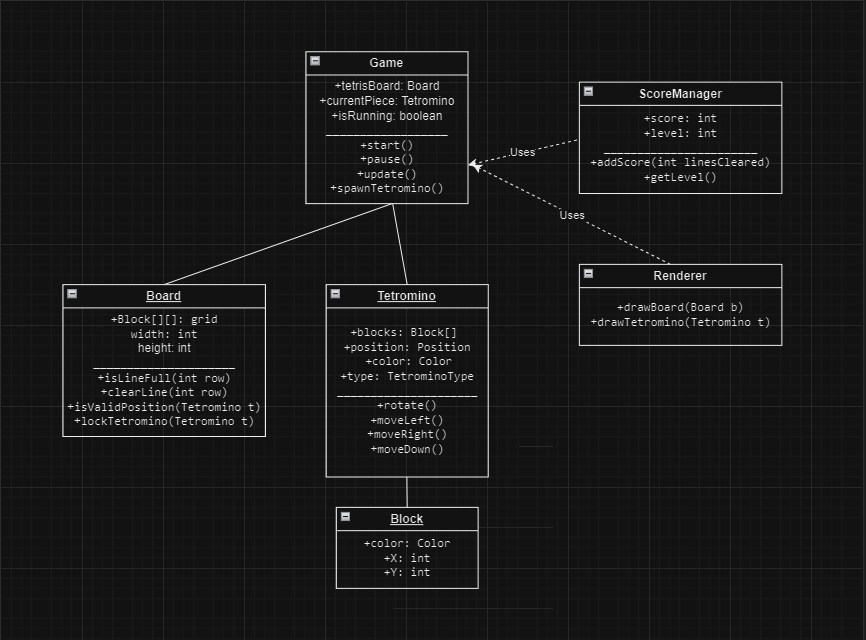

# Technical Details:

PERIOD 5
Jerry Wang and Brian Zheng
~Tetris Gaming but We Can't Play Tetris~ DeathTris

A description of your technical design. ~This should include:~

Brief Project Description

We will be creating a recreation of the singleplayer Tetris. Our game will incorporate all the defining features of Tetris, that is, the pieces will fall at an increasing speed, the pieces can be rotated 90 degrees, and completely filling up row(s) will clear those row(s). We will also try to add our personal touch to the game. The game itself will function in processing, and we want to make it somewhat smooth in terms of animation (but still have the blocks
move like they would in the original game). Personal touches could be concerning the speed and actually tiles released, with one of our main gimmicks
being "modes". Such modes could be "Floor is Lava" (where certain levels become unbreakable after a certain time) and having new tiles, etc. (updated)

Expanded Description
Our minimum viable product is a playable tetris that has all the features of a regular tetris game. More specifically, it will not have a time limit and will not have any other tetrimino besides the ones inherently in the game. As for the controls, the left, right, and down arrow keys move the tetrimino left, right and down; the up arrow key moves the piece slowly down, and the space bar hard drops the piece. Furthermore, only one piece can be saved and then later retrieved at a time, with the piece must being used after it is retrieved. 
After we achieve our MVP, we plan to incorporate various modes and gimmicks into tbe game. As mentioned previously, "the floor is lava" will cause more and more rows to become unclearable, with these rows becoming completely full with red blocks (lava). There will also be random reversals in gravity, as well as the entire board flipping. (new)

# Project Design

Descriptions:

### `Game`
- **Fields:**
  - `+tetrisBoard: Board`
  - `+currentPiece: Tetromino`
  - `+isRunning: boolean`
- **Methods:**
  - `+start()`
  - `+pause()`
  - `+update()`
  - `+spawnTetromino()`
- **Role:** Central controller. Manages game flow, input, and game state.

---

### `Board`
- **Fields:**
  - `+grid: Block[][]`
  - `width: int`
  - `height: int`
- **Methods:**
  - `+isLineFull(int row)`
  - `+clearLine(int row)`
  - `+isValidPosition(Tetromino t)`
  - `+lockTetromino(Tetromino t)`
- **Role:** Represents the game field and logic for block placement and clearing.

---

### `Tetromino`
- **Fields:**
  - `+blocks: Block[]`
  - `+position: Position`
  - `+color: Color`
  - `+type: TetrominoType`
- **Methods:**
  - `+rotate()`
  - `+moveLeft()`
  - `+moveRight()`
  - `+moveDown()`
- **Role:** Represents and manages a Tetris piece’s behavior and movement.

---

### `Block`
- **Fields:**
  - `+color: Color`
  - `+x: int`
  - `+y: int`
- **Role:** Individual unit in the grid or Tetromino.

---

### `ScoreManager`
- **Fields:**
  - `+score: int`
  - `+level: int`
- **Methods:**
  - `+addScore(int linesCleared)`
  - `+getLevel()`
- **Role:** Manages the player’s score and level progression.

---

### `Renderer`
- **Methods:**
  - `+drawBoard(Board b)`
  - `+drawTetromino(Tetromino t)`
- **Role:** Renders game elements to the screen using Processing.

---
    
# Intended pacing:

| Component                  | Description                                                      | Assigned To |
| -------------------------- | ---------------------------------------------------------------- | ----------- |
| **Game Core**              | Game loop, state management, starting/pausing/resetting the game | Jerry       |
| **Grid/Board System**      | Managing the 2D grid, locking pieces, clearing lines             | Brian       |
| **Tetromino Logic**        | Defining shapes, rotation logic, movement                        | Jerry       |
| **Collision Detection**    | Checking for valid movement, piece placement                     | Brian       |
| **Rendering**              | Drawing the board and pieces using Processing                    | Jerry       |
| **Input Handling**         | Managing user input (left, right, down, rotate, pause)           | Brian       |
| **Score & Level System**   | Tracking score, level increase based on cleared lines            | Jerry       |
| **Game Over Conditions**   | Detecting when pieces reach the top and ending the game          | Brian       |
| **UI Elements**            | Displaying score, level, next piece (if implemented)             | Shared      |
| **Final Polish & Testing** | Bug fixes, code cleanup, performance optimization                | Shared      |

| Date Range      | Tasks                                                                        | Assigned To                      |
| --------------- | ---------------------------------------------------------------------------- | -------------------------------- |
| **May 21 – 23** | Set up project structure in Processing, basic game loop, input handling      | Jerry (setup), Brian (input)     |
| **May 24 – 26** | Implement grid system and Tetromino shape logic, piece movement and rotation | Brian (grid), Jerry (tetromino)  |
| **May 27 – 28** | Collision detection, piece locking, line clearing logic                      | Brian                            |
| **May 29 – 30** | Scoring system, levels, and game-over conditions                             | Jerry (score), Brian (game-over) |
| **May 31**      | UI elements and render polish (score display, next piece box if added)       | Shared                           |
| **June 1 – 2**  | Testing, bug fixing, refining game feel and performance                      | Shared                           |

